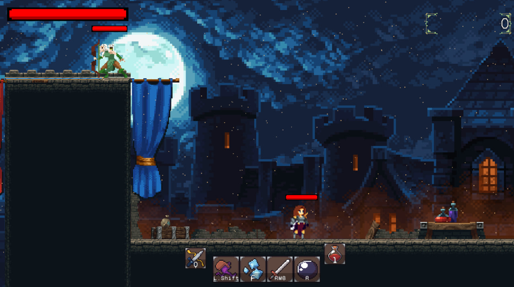
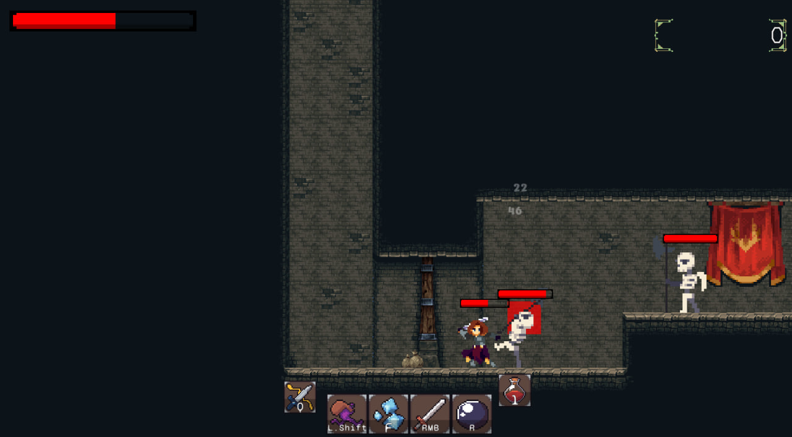
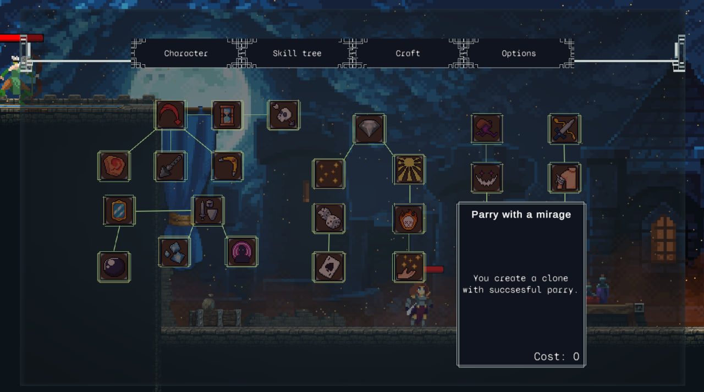
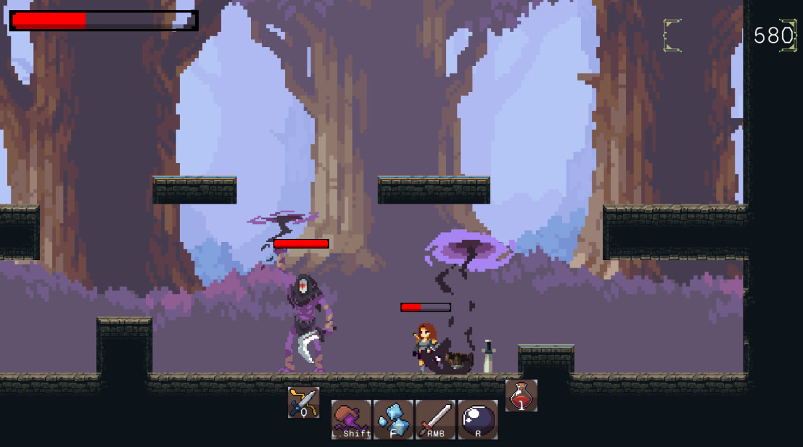
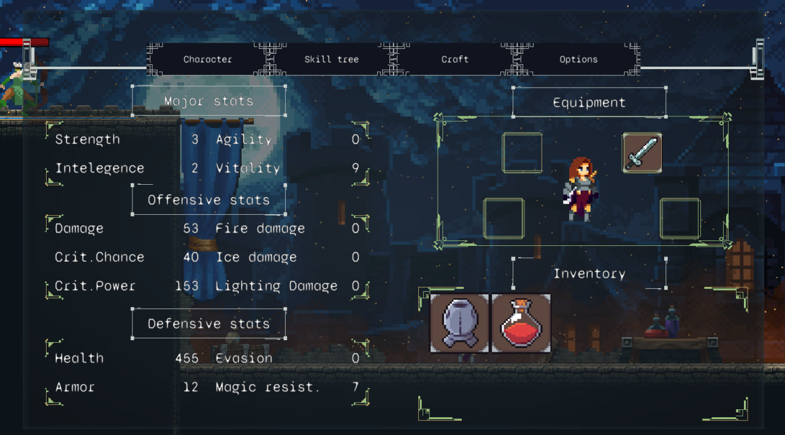

# ⚔️ Shadowspire RPG

**Shadowspire RPG** is a 2D action RPG developed in Unity. Dive into dark, cursed lands, slay enemies, gather loot and materials, and upgrade your skills and equipment to survive ever-growing dangers.

## 📸 Screenshots

<p align="center">
  
  
  
  
  
</p>

## 🎮 Features

- ⚔️ Dynamic real-time combat with melee and ranged attacks  
- 📈 XP system with unlockable skills and abilities  
- 🛠️ Loot, gather and craft weapons, armor, and items  
- 🌒 Atmospheric pixel-art visuals and dark fantasy vibe  
- 🧟 Enemy variety and challenging encounters  

## 🚀 Installation and launch

1. Make sure you have **Unity Hub** and **Unity Editor** installed (recommended: Unity `2022.3.X` — check `ProjectSettings/ProjectVersion.txt`).
2. Clone the repository:
   ```bash
   git clone https://github.com/RochiFox/shadowspire-rpg.git
3. Open the project via Unity Hub.
4. Click Play to launch the game in the editor.

## 🎮 Play the Game

⬇️ [Download Windows Build](https://github.com/RochiFox/shadowspire-rpg/releases/latest)
